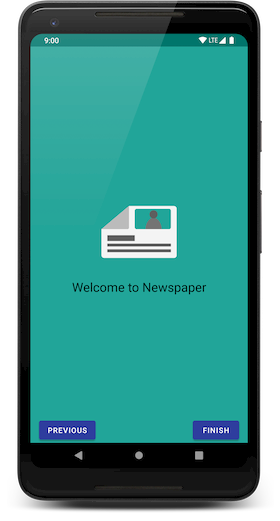
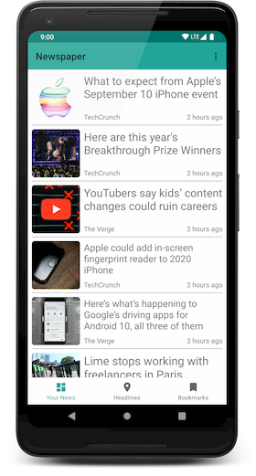
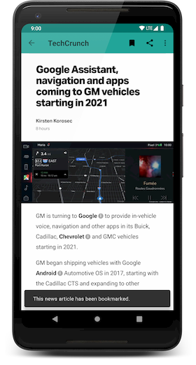

# Newspaper
> A simple news app, built with Kotlin and Android Jetpack.

This is a material design complient news app that lets you choose what you want to be updated about.
News provided by [newsapi.org](https://newsapi.org/)

  

## Installation
This app is only compatible with Android L and higher.

The apk file is available for download under the [releases](https://github.com/Talha-Ak/Newspaper/releases/latest) tab.

To build this project, use the "gradlew build" command or use "Import Project" in Android Studio.
## Libraries Used

This app is built upon [Android Jetpack](https://developer.android.com/jetpack), a collection of Android software components that encourages modern software design practices (like separation of concerns & testing).

* Android Jetpack
  * [AppCompat](https://developer.android.com/topic/libraries/support-library/packages.html#v7-appcompat) - Degrade gracefully on older versions of Android
  * [Android KTX](https://developer.android.com/kotlin/ktx.html) - Used to write more concise, idiomatic Kotlin code
  * [Data Binding](https://developer.android.com/topic/libraries/data-binding/) - For declaratively bind observable data to UI elements
  * [LiveData](https://developer.android.com/topic/libraries/architecture/livedata) - Notifies views when underlying database changes (which itself implements [Lifecycles](https://developer.android.com/topic/libraries/architecture/lifecycle))
  * [Navigation](https://developer.android.com/topic/libraries/architecture/navigation.html) - Handle everything needed for in-app navigation
  * [Room](https://developer.android.com/topic/libraries/architecture/room) - Fluent SQLite database access
  * [ViewModel](https://developer.android.com/topic/libraries/architecture/viewmodel) - Manage UI-related data in a lifecycle-conscious way
  * [WorkManager](https://developer.android.com/topic/libraries/architecture/workmanager) - Manages Android background jobs
* [Kotlin Coroutines](https://kotlinlang.org/docs/reference/coroutines-overview.html) - Asynchronous programming in a sequential pattern
* Third Party
  * [Glide](https://github.com/bumptech/glide) - For easy image loading
  * [Retrofit](https://github.com/square/retrofit) - For a type-safe & object based HTTP client
  * [Lottie](https://airbnb.design/lottie/) - For simple animations using After Effects